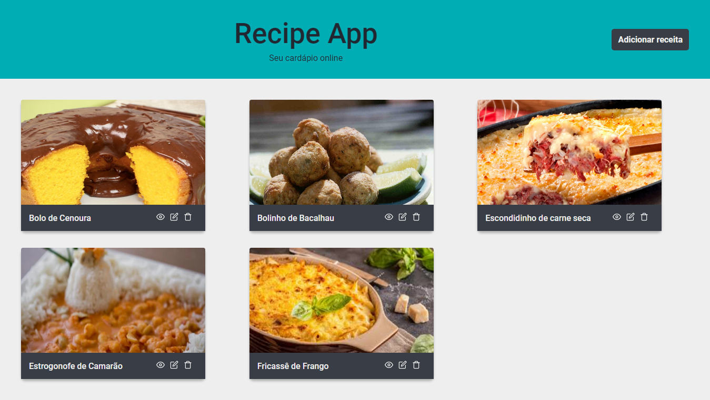

<h1 align="center">Recipe App</h1
<p align="center">Recipe App é uma aplicação para cadastrar, editar, listar e deletar receitas.</p>

<h1 align="center">
  
</h1>

<p align="center">
 <a href="#tecnologias">Tecnologias</a> •  
 <a href="#como-usar">Como usar</a> • 
 <a href="#autor">Autor</a>
</p>


## Tecnologias

-  [ReactJS](https://reactjs.org/)
-  [React Router ](https://github.com/ReactTraining/react-router)
-  [styled-components](https://www.styled-components.com/)
-  [axios](https://github.com/axios/axios)
-  [json-server](https://github.com/typicode/json-server)

## Como Usar

```bash
# Clone o repositório
$ https://github.com/MuriloCicolin/Recipe-App

# Vá para pasta do repositório
$ cd Recipe-App

# Instale as dependências 
$ yarn install

# Rode a Aplicação
$ yarn start
```

## Autor
Feito por Murilo Cicolin! Entre em contato <br/>
 [](https://www.linkedin.com/in/murilo-cicolin/) 
[](mailto:mu.cicolin@gmail.com)


 
